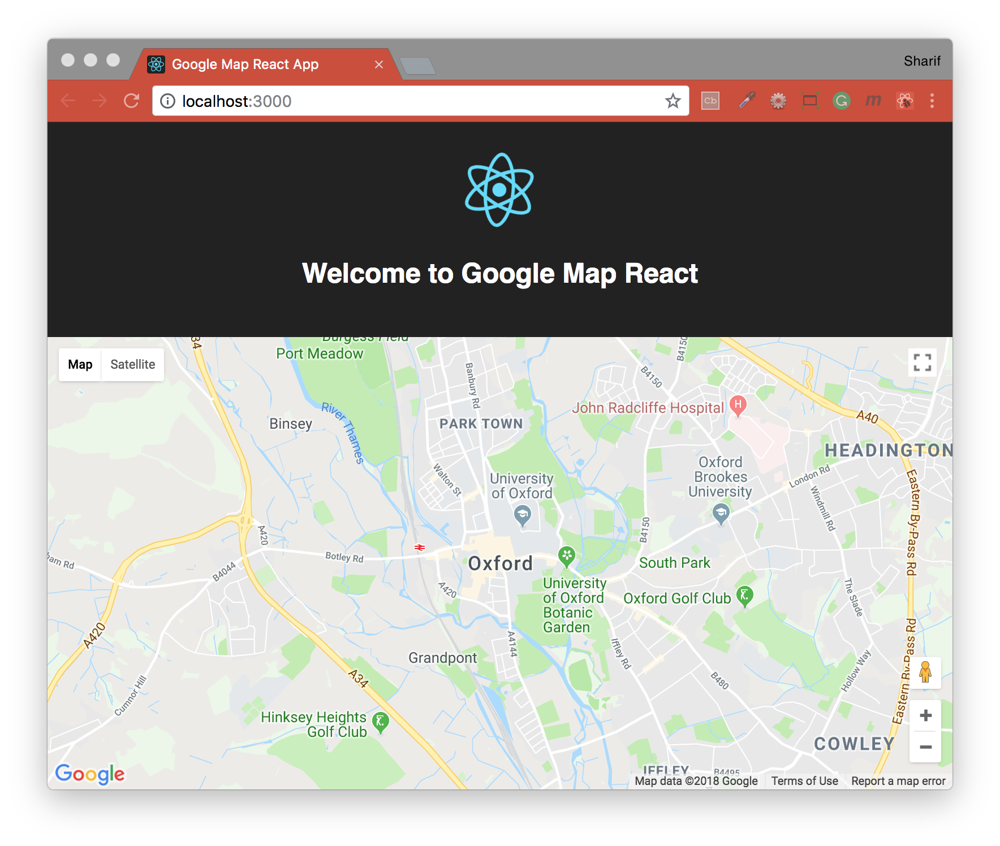

## Maps JavaScript API

#### Google Map Examples
- [One HTML File](./basicHTML/BASIC.md)
- [Basic React Setup](./basicReact/REACT.md)
- [Additinal Features](./finalReact/FINAL.md)

#### Overview
The Maps JavaScript API lets you customize maps with your own content and imagery for display on web pages and mobile devices. The Maps JavaScript API features four basic map types (roadmap, satellite, hybrid, and terrain) which you can modify using layers and styles, controls and events, and various services and libraries.

#### Google API key
To use the Maps JavaScript API, you must register your app project on the Google Cloud Platform Console and get a Google API key which you can add to your app.

Link - [Quick guide to getting a key](https://developers.google.com/maps/documentation/javascript/get-api-key)
