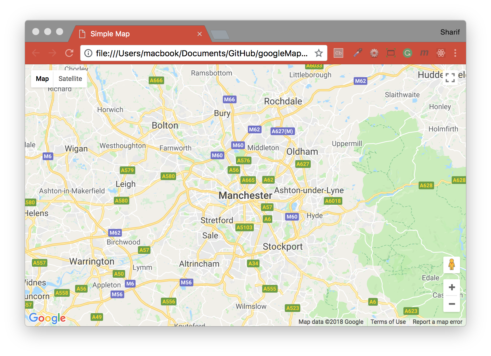

## Maps JavaScript API


#### One Google Map HTML File Example
[Source: Google Maps Tutorial](https://developers.google.com/maps/documentation/javascript/tutorial)

In this simple example, there are a few things to note:
- Declare the application as HTML5 using the `<!DOCTYPE html>` declaration.
- Create a div element named `"map"` to hold the map.
- Define a JavaScript function that creates a map in the `div`.
- Load the Maps JavaScript API using a `<script>` tag.

#### Initial Setup for `Google Map React`:
- Add Google API key to `index.html` file in `/public` folder
```html
<script src="https://maps.googleapis.com/maps/api/js?key=YOUR_API_KEY_GOES_HERE&callback=initMap"></script>
```

#### Declaring your application as HTML5
```html
<!DOCTYPE html>
```
Most current browsers will render content that is declared with this DOCTYPE in "standards mode" which means that your application should be more cross-browser compliant. The DOCTYPE is also designed to degrade gracefully; browsers that don't understand it will ignore it, and use "quirks mode" to display their content.

Note that some CSS that works within quirks mode is not valid in standards mode. In specific, all percentage-based sizes must inherit from parent block elements, and if any of those ancestors fail to specify a size, they are assumed to be sized at 0 x 0 pixels.
```html
<style>
  #map {
    height: 100%;
  }
  html, body {
    height: 100%;
    margin: 0;
    padding: 0;
  }
</style>
```
This CSS declaration indicates that the map container `<div>` (with id map) should take up 100% of the height of the HTML body. Note that we must specifically declare those percentages for <body> and <html> as well.

#### Loading the Maps JavaScript API
To load the Maps JavaScript API, use a script tag like the one in the following example:
```html
<script async defer
  src="https://maps.googleapis.com/maps/api/js?key=YOUR_API_KEY&callback=initMap">
</script>
```
The URL contained in the script tag is the location of a JavaScript file that loads all of the symbols and definitions you need for using the Maps JavaScript API.

The async attribute lets the browser render the rest of your website while the Maps JavaScript API loads. When the API is ready, it will call the function specified using the callback parameter.

The key parameter contains your application's API key.

#### Map DOM Elements
```html
<div id="map"></div>
```
For the map to display on a web page, we must reserve a spot for it by creating a named div element, and obtaining a reference to this element in the browser's document object model (DOM).

We used CSS to set the height of the map div to "100%". This will expand to fit the size on mobile devices. Note that divs usually take their width from their containing element, and empty divs usually have 0 height. For this reason, you must always set a height on the `<div>` explicitly.

#### Map Options
There are two required options for every map: center and zoom.
```js
map = new google.maps.Map(document.getElementById('map'), {
  center: {lat: -34.397, lng: 150.644},
  zoom: 8
});
```
#### Zoom Levels
The initial resolution at which to display the map is set by the zoom property, where zoom 0 corresponds to a map of the Earth fully zoomed out, and larger zoom levels zoom in at a higher resolution.
```js
zoom: 8
```
Map images within Google Maps and the Maps JavaScript API are broken up into map "tiles" and "zoom levels." At low zoom levels, a small set of map tiles covers a wide area; at higher zoom levels, the tiles are of higher resolution and cover a smaller area.

The following list shows the approximate level of detail you can expect to see at each zoom level:
```js
1: World
5: Landmass/continent
10: City
15: Streets
20: Buildings
```

[Return to README.md](../README.md)
