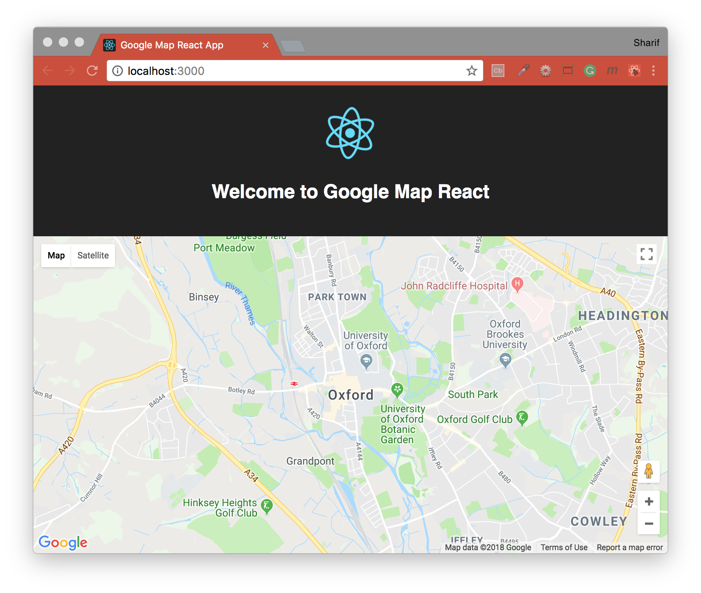

## Maps JavaScript API


#### Google Map React Example
Source: [How To Render A Map Component Using ‘react-google-maps’](https://medium.com/@yelstin.fernandes/render-a-map-component-using-react-google-maps-5f7fb3e418bb)
Credit to: [Yelstin Fernandes](https://github.com/yfern328)

This project was bootstrapped with [Create React App](https://github.com/facebookincubator/create-react-app).

#### Built with
* [npm](https://www.npmjs.com/) - Node Package Manager
* [React](https://www.npmjs.com/package/react) - An npm package to get you immediate access to React
* [React DOM](https://www.npmjs.com/package/react-dom) - This package serves as the entry point of the DOM-related rendering paths
* [react-google-maps](https://tomchentw.github.io/react-google-maps/) - Render any React component on the Google Map

#### Initial Setup for `Google Map React`:
- Add Google API key to `index.html` file in `/public` folder
```html
<script src="https://maps.googleapis.com/maps/api/js?key=YOUR_API_KEY_GOES_HERE"></script>
```
#### Running the App:
To run this project you will need to download it onto your local machine and install all dependencies.
Navigate inside the folders and install all dependencies and run the app by entering the following command on your terminal window:
```bash
# install dependencies
npm install
# launch app on localhost:3000
npm start
```
If you want to end the process hold `control` and press `c` in mac, if you are not using mac hold `ctrl` and press `c`.

#### Building Out The Map Component
```js
import React, { Component } from 'react';
// Importing ‘withGoogleMap’ (a Higher Order Component) and ‘GoogleMap’ (which is going to take in map props) from ‘react-google-maps’.
import { withGoogleMap, GoogleMap } from 'react-google-maps';
class Map extends Component {
  render() {
  // Creating a constant that uses ‘withGoogleMap’ and ‘GoogleMap’ we've imported.
  const GoogleMapExample = withGoogleMap(props => (
    // Pass in two props into ‘GoogleMap’ to get the component to work, ‘defaultCenter’ and ‘defaultZoom’.
    <GoogleMap
      // Latitude and longitude in the form of an object to defaultCenter, and a value into defaultZoom.
      defaultCenter = { { lat: 40.756795, lng: -73.954298 } }
      defaultZoom = { 13 }
    >
    </GoogleMap>
  ));
  return(
    // Return the const in a div that takes in props of ‘containerElement’ and ‘mapElement’.
    <div>
      <GoogleMapExample
        // The container element is going to hold our map element.
        // Height and width of the container can be set to any value; fixed pixel size, viewport height, or percentage of the screen.
        containerElement={ <div style={{ height: `500px`, width: '500px' }} /> }
        // For the map element, height 100% will fill the container.
        mapElement={ <div style={{ height: `100%` }} /> }
      />
    </div>
    );
  }
};
export default Map;
```

[Return to README.md](../README.md)
